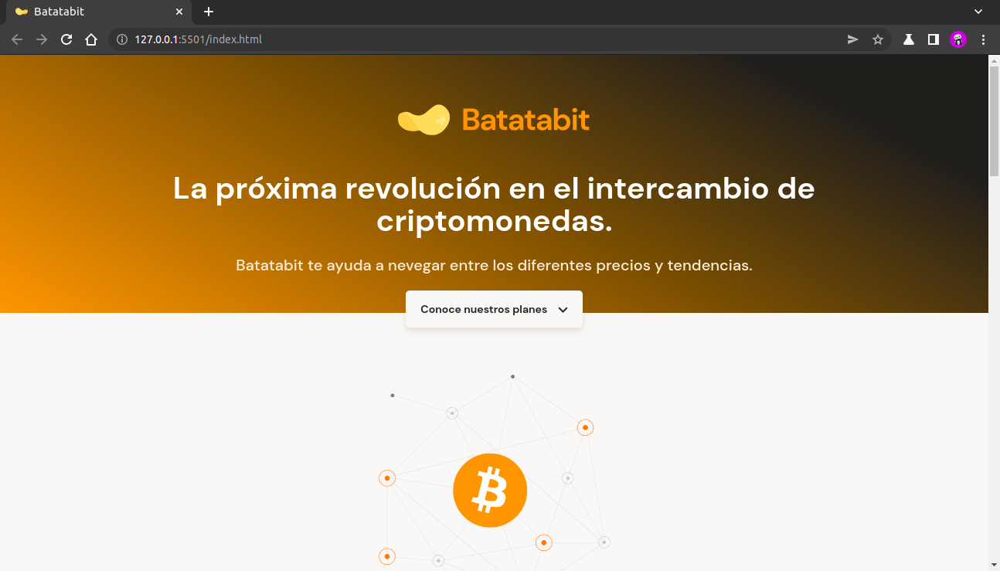
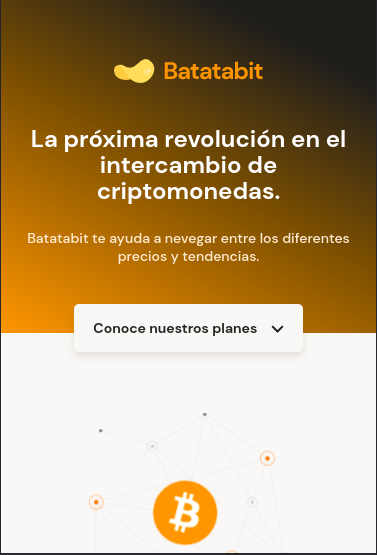

# Batatabit
Proyecto de maquetación basado en un prototipo de Figma, siguiendo la metodología de mobile first. Se trata de una plataforma para comprar y vender criptomonedas.

## Ver está página:
https://francocarballar.github.io/batatabit

## Diseño en figma:
https://www.figma.com/file/sMmlQaZldfDcLERYYWe6h4/Bata-Bit?node-id=44%3A594

## Tecnologías utilizadas:
- HTML
- CSS
- Responsive Design (Siguiendo la metodología de Mobile First)

## Habilidades adquiridas: 
Aprendí a crear diseños web responsivos, que se adaptan a los dispositivos que se están usando. También aprendí a crear una página web basandome en un diseño creado en Figma.

## Imágenes:
- Desktop: 

- Mobile:

### Creado por @francocarballar